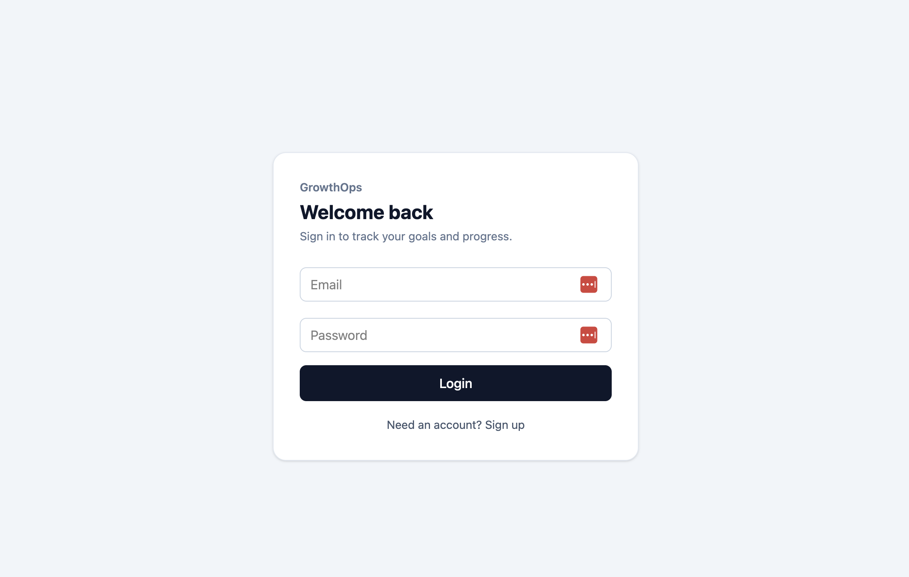
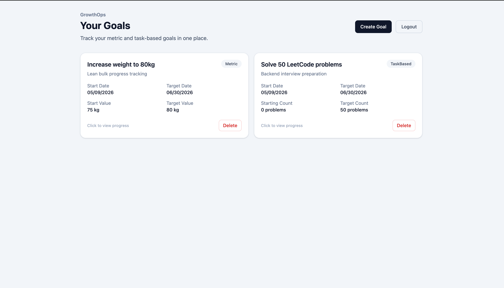
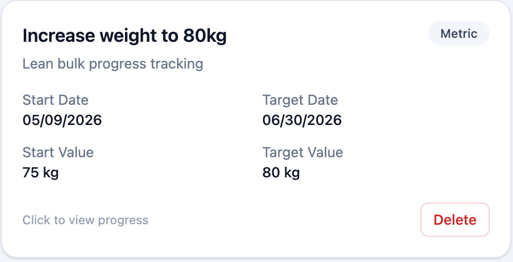
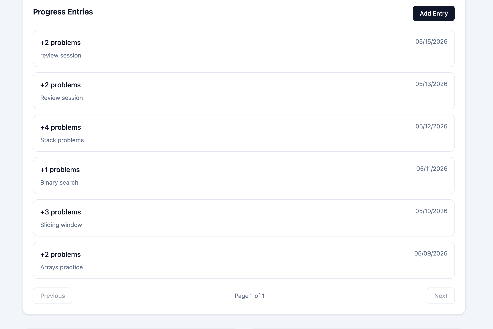

# GrowthOps

GrowthOps is a full-stack goal tracking application built with ASP.NET Core, PostgreSQL, Entity Framework Core, JWT authentication, and React.

The application allows users to create metric-based and task-based goals, log progress entries, view progress history, track streaks, and visualize progress through chart-based analytics.

This project was built to strengthen backend development skills around API design, authentication, authorization, database modeling, EF Core, PostgreSQL, Docker, pagination, and full-stack integration.

---

## Features

- User registration and login
- JWT-based authentication
- Protected API endpoints
- User-specific goal ownership checks
- Create and delete goals
- Metric-based goals, such as weight, savings, or running distance
- Task-based goals, such as solving LeetCode problems
- Add progress entries for each goal
- View progress history with pagination
- View progress summary and completion percentage
- Track current and longest streaks
- View chart data for goal progress over time
- PostgreSQL database running through Docker
- React frontend connected to the API

---

## Tech Stack

### Backend

- ASP.NET Core Minimal API
- C#
- Entity Framework Core
- PostgreSQL
- JWT Bearer Authentication
- Docker Compose
- Swagger / OpenAPI

### Frontend

- React
- TypeScript
- Vite
- Tailwind CSS
- Recharts

### Tools

- Docker Desktop
- DBeaver
- VS Code
- Swagger UI

---

## Architecture

GrowthOps follows a simple full-stack architecture:

```text
React UI
  ↓
ASP.NET Core Minimal API
  ↓
Application Services
  ↓
Entity Framework Core DbContext
  ↓
PostgreSQL
```

The frontend sends HTTP requests to the ASP.NET Core API. The backend handles authentication, authorization, business logic, database access, and response shaping. Entity Framework Core is used to query and persist data in PostgreSQL.

---

## Key Backend Concepts

### Authentication

GrowthOps uses JWT Bearer Authentication. After a successful login, the backend returns a signed JWT. The frontend sends this token with protected requests using the `Authorization: Bearer <token>` header.

The backend validates the token before allowing access to protected endpoints.

### Authorization and User Ownership

The API does not only check whether a user is logged in. It also checks whether the requested resource belongs to the logged-in user.

For example, when fetching, updating, or deleting a goal, the backend verifies that the goal belongs to the authenticated user.

This prevents one user from accessing another user’s goals or progress entries.

### Entity Framework Core and PostgreSQL

EF Core is used as the ORM for database access. The application models users, goals, and progress entries as C# classes, which EF Core maps to PostgreSQL tables.

The main relationship structure is:

```text
User → Goals → ProgressEntries
```

A user can have many goals, and each goal can have many progress entries.

### DateOnly Refactor

Goal dates and progress logged dates are modeled using `DateOnly` because they represent calendar dates, not exact timestamps.

This avoids timezone-related bugs where a selected date could shift between UTC and local time.

`CreatedAtUtc` is still stored as a `DateTime` because it represents the exact moment a record was created.

### Pagination

Progress entries are paginated so the API does not return all records at once.

Example request:

```http
GET /goals/4/entries?page=1&pageSize=10
```

The backend returns a paged response containing the requested items, current page, page size, total count, and total pages.

Pagination improves performance, reduces response size, and keeps the UI cleaner.

### Analytics and Chart Data

GrowthOps calculates progress summaries, streaks, and chart data on the backend.

Metric-based goals use logged values over time. Task-based goals use completed task counts over time. This allows the frontend to display useful insights without duplicating business logic.

---

## API Highlights

Example endpoints:

```http
POST /auth/register
POST /auth/login
GET /me

GET /goals
POST /goals
GET /goals/{id}
DELETE /goals/{id}

GET /goals/{id}/entries?page=1&pageSize=10
POST /goals/{id}/entries

GET /goals/{id}/summary
GET /goals/{id}/streak
GET /goals/{id}/chart
GET /goals/{id}/analytics
```

---

## Screenshots

Add screenshots here after saving them in a `docs/screenshots` folder.

```md
### Login



### Dashboard



### Goal Detail and Analytics



### Progress Entries and Pagination


```

---

## Local Setup

### 1. Start PostgreSQL with Docker

From the project root:

```bash
docker compose up
```

### 2. Apply EF Core migrations

```bash
dotnet ef database update --project GrowthOps.Api
```

### 3. Run the API

```bash
dotnet run --project GrowthOps.Api
```

The API can be tested through Swagger UI.

### 4. Run the React UI

```bash
cd GrowthOps.Ui
npm install
npm run dev
```

---

## What I Learned

While building GrowthOps, I practiced:

- ASP.NET Core Minimal API development
- JWT authentication and protected endpoints
- User-specific authorization and ownership checks
- EF Core models, DbContext, DbSet, migrations, and relationships
- PostgreSQL schema design
- Docker-based local database setup
- Pagination using `Skip` and `Take`
- Date modeling using `DateOnly` and `DateTime`
- Backend-generated analytics and chart data
- React API integration with a backend service
- Full-stack debugging across frontend, backend, and database layers

---

## Future Improvements

Possible future improvements include:

- Replace localStorage JWT storage with HTTP-only cookie authentication
- Add refresh token support
- Add global error handling middleware
- Add structured logging with `ILogger`
- Add unit tests for progress, streak, and chart logic
- Add integration tests for protected endpoints
- Add goal editing support
- Add date range filters for charts
- Add deployment to a cloud platform such as Azure
- Add CI/CD pipeline for automated build and test checks
